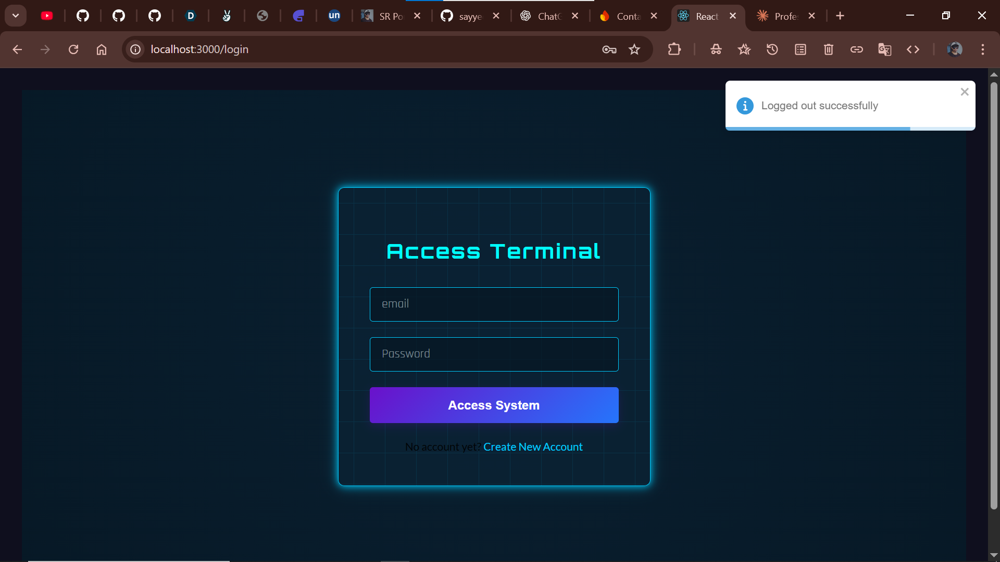
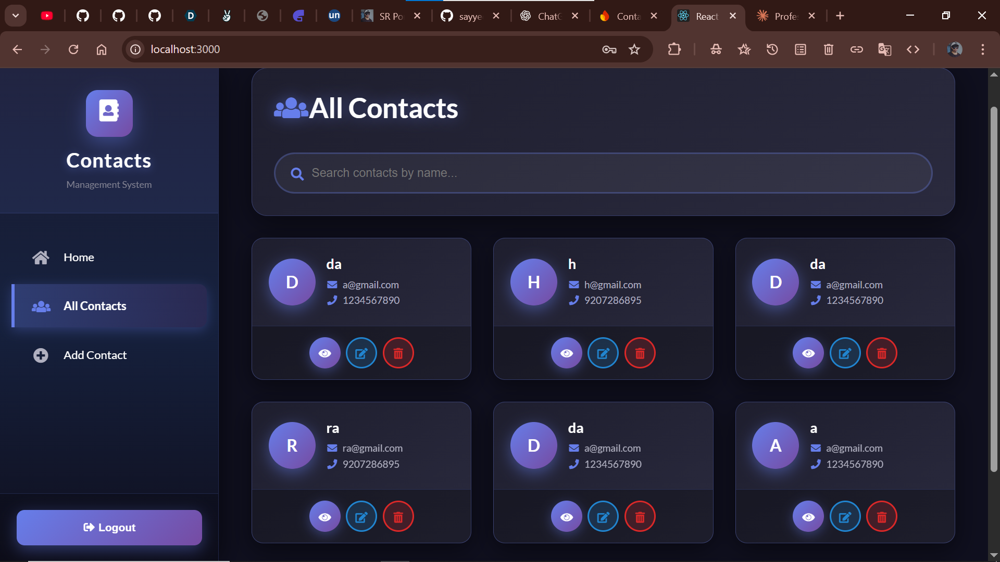
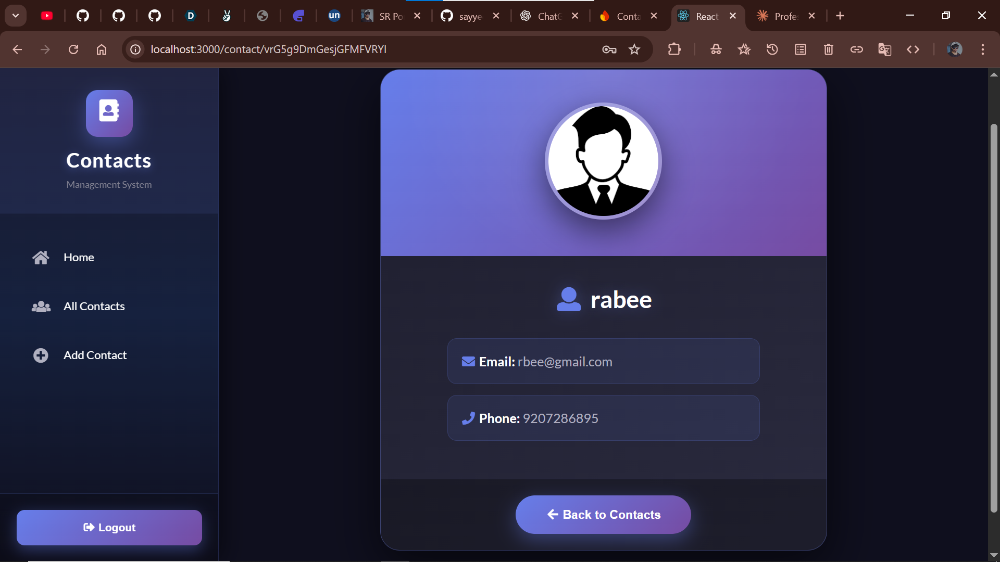
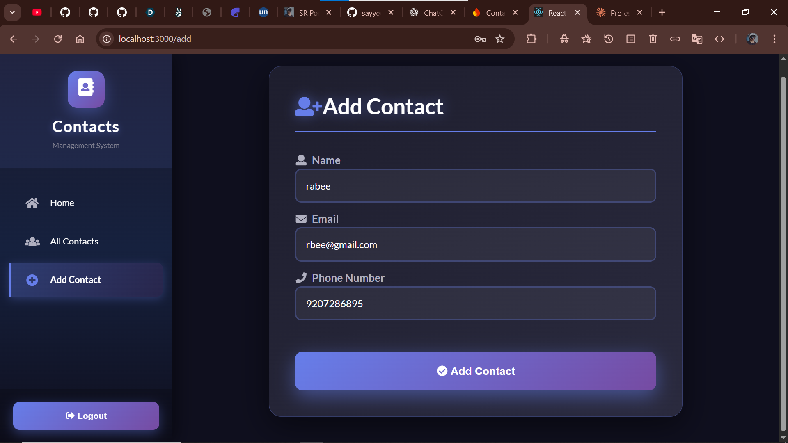

 
#  Contact Manager (React + Semantic UI + Firebase)

[](https://contact-app-94c8a.web.app)  
[](LICENSE)

---

##  Live Demo

Visit the live version here: **[https://contact-app-94c8a.web.app](https://contact-app-94c8a.web.app)**

---

##  Overview

**Contact Manager** is a sleek, responsive single-page **React** application styled with **Semantic UI**, powered by **Firebase** for authentication and real-time database (Firestore).  
Users can **sign up**, **log in**, and manage their personal contact list: add new contacts, edit existing ones, search through them dynamically, and delete if needed.

---

##  Features

- **User Authentication**  
  Secure login and registration powered by **Firebase Authentication**.

- **Contacts CRUD**  
  - Add new contacts (name, phone, email, etc.)  
  - Edit existing contacts  
  - Delete unwanted contacts  
  - Search contacts in real time

- **Persistent Storage**  
  Built on **Firebase Firestore**, allowing each user to have a private contact list.

- **Responsive UI**  
  Designed with **Semantic UI React** to look great on both desktop and mobile.

- **Hosted on Firebase**  
  Live deployment via **Firebase Hosting**.

---

 
##  App Preview Gallery

<table align="center">
  <tr>
    <th>Login</th>
    <th>Home</th>
    <th>Contacts</th>
  </tr>
  <tr>
    <td></td>
    <td></td>
    <td></td>
  </tr>
  <tr>
    <th>Contact Card</th>
    <th>Add Contact</th>
  </tr>
  <tr>
    <td></td>
    <td></td>
  </tr>
</table>

---

##  Tech Stack

- **Frontend**: React, Semantic UI React  
- **Backend / Services**: Firebase Authentication, Firestore, Firebase Hosting  
- **State Management**: React hooks, Context API (or local state, depending on your code)  
- **Build Tools**: Create React App 

---

##  Setup & Installation

1. **Clone the repository**

   ```bash
   git clone https://github.com/sayyedrabeeh/contact_app-react-semantic-ui.git
   cd contact_app-react-semantic-ui
   ```

2. **Install dependencies**

   ```bash
   npm install
   # or
   yarn install
   ```

3. **Firebase configuration**

   * Create a Firebase project at [Firebase Console](https://console.firebase.google.com/).
   * Enable **Authentication** (Email/Password, or other providers you prefer).
   * Enable **Cloud Firestore** database.
   * Copy your Firebase config (API key, auth domain, projectId, etc.) into your React app.
     Usually in a file like `src/firebase.js` or `.env` (depending on how you structured it).

4. **Run locally**

   ```bash
   npm start
   # or
   yarn start
   ```

   The app should now run on `http://localhost:3000`.

5. **Deploy to Firebase**

   If you want to deploy your own version:

   ```bash
   npm install -g firebase-tools
   firebase login
   firebase init
   # Choose Hosting, Firestore, etc.
   firebase deploy
   ```

---

##  Folder Structure

```
contact_app-react-semantic-ui/
├── public/                  # Static files, HTML template
├── src/
│   ├── components/          # Reusable UI components (ContactItem, Form, Navbar ...)
│   ├── contexts/            # Context API providers (e.g. AuthContext)
│   ├── firebase/            # Firebase initialization & service wrappers
│   ├── pages/               # Pages like Login, Register, Dashboard, AddContact ...
│   ├── styles/              # Custom CSS (if any)
│   ├── utils/                # Helper functions
│   └── App.js                # Entry point / Router
├── .firebaserc               # Firebase project aliases
├── firebase.json             # Firebase configuration for hosting
├── package.json               # Project dependencies
└── README.md                  # ← You are here
```

---

 
 
##  License

Distributed under the **MIT License**. See `LICENSE` for more information.

---

 
##  Contact

Have feedback, bug reports or feature requests?
Feel free to open an issue or reach out to **[sayyedrabeeh](https://github.com/sayyedrabeeh)**.

---

**Thank you for using / reviewing this app!**
 Built with sayyed rabeeh .

 

 

[1]: https://github.com/eddedd88/react-firebase-template?utm_source=chatgpt.com "GitHub - eddedd88/react-firebase-template: Bootstrap a React + Firebase full stack application with every thing you need pre-configured: hosting, database, authentication, CI, Typescript, Material UI, PWA and other goodies."
